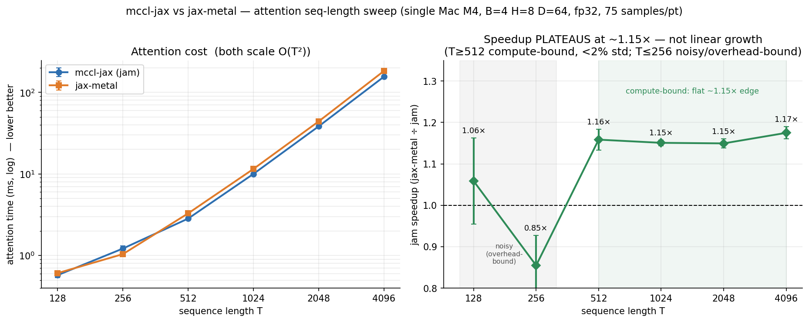

# mccl-jax

A JAX **PJRT plugin** that runs JAX on Apple-Silicon GPUs and does cross-Mac collectives over
Thunderbolt — open Metal compute plus multi-host collectives via [mccl](../mccl). jaxlib emits
StableHLO; the plugin lowers it to MPSGraph and routes collective ops to mccl.

# build

```sh
cmake -S . -B build && cmake --build build      # -> build/libpjrt_metal.dylib
```

The build needs LLVM/MLIR + the openxla/stablehlo libraries for the `src/jam` compiler. Point CMake
at them and the Metal toolchain (Xcode CLT) does the rest:

```sh
cmake -S . -B build -DMLIR_DIR=$LLVM/lib/cmake/mlir -DStablehlo_DIR=$STABLEHLO/lib/cmake/stablehlo
cmake --build build
```

`src/mccl/collective` builds against a built `libmccl` (`MCCL_HOME`, default `~/mccl`).

# install

Register the plugin with JAX:

```python
import jax._src.xla_bridge as xb
xb.register_plugin("metal", priority=400, library_path=".../build/libpjrt_metal.dylib")
import jax
jax.devices("metal")
```

## Benchmark


